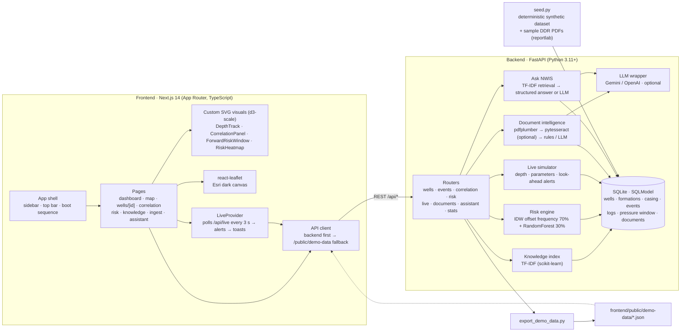
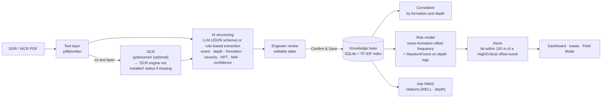

# eRTMAC · NWIS — Nearby Wells Intelligence System

**Smart India Hackathon 2026 · PS SIH26121 · Oil India Limited**

A decision-support platform that sits alongside eRTMAC (Oil India's real-time drilling monitoring system) and gives the drilling team the one thing eRTMAC cannot: the *memory* of every nearby well. NWIS turns Well Completion Reports and Daily Drilling Reports into a searchable knowledge base, correlates offset wells by formation and depth, predicts the problems ahead of the bit, and raises alerts and recommendations while the well is being drilled.

> **All data in this prototype is SYNTHETIC DEMONSTRATION DATA.** Wells, positions, reports and the live feed are generated deterministically for Upper Assam fields (Duliajan, Naharkatiya, Moran, Baghjan, Hugrijan). The live feed is **SIMULATED**. Nothing here describes a real operation.

---

## The problem

Drilling decisions in complex formations depend on what happened in the wells around you: where offsets lost mud, where they got stuck, where the pore pressure ramped. That knowledge exists, but it is locked in PDF reports and individual memory. eRTMAC shows the live well; nobody shows the *neighbourhood*. NWIS answers, for every screen, one operational question:

| Module | Question it answers |
| --- | --- |
| Operations Overview | What is happening right now? |
| Nearby Wells Map | What nearby wells can teach us? |
| Well Profile | What happened while this well was drilled? |
| Offset Correlation | Where do formations and incidents align? |
| Risk Forecast | What problems may occur ahead? |
| Knowledge Base | What has historical experience taught us? |
| Document Intelligence | How do old reports become institutional knowledge? |
| Ask NWIS | How can an engineer retrieve that knowledge instantly? |

## Features

- **Live Drilling Command Center** — simulated eRTMAC feed (≈2 m every 3 s), current depth, formation and upcoming formation, eight live parameters with sparklines, rig state, a well-path strip with the 150 m look-ahead window and offset risk markers, and an Active Intelligence panel that turns the top alert into evidence plus a recommended action.
- **Geospatial map** — dark basemap, amber active well with radar pulse, adjustable offset window (1–25 km), severity-haloed well markers, event-type and formation filters, an intelligence drawer per well.
- **Well Depth Track** — a custom SVG track (d3-scale) with nine aligned lanes: depth ruler, formation column, lithology patterns, casing strings with cement, incident markers, ROP, torque, mud-weight window (pore pressure, fracture gradient, MW, ECD, hatched overpressure) and gas. One crosshair across every lane.
- **Offset Correlation** — 2–5 stratigraphic columns with curved correlation lines and cross-section fills, casing and incident overlays, equivalent-event highlighting, and datum flattening.
- **Forward Drilling Risk Window** — predicted risk zones ahead of the bit, scored 0–100 per 50 m bin and event type, with the evidence behind every zone (analogous offset events, nearest offset, severity, indicators, recommended action and mud weight). A depth × event-type heatmap is the secondary view.
- **Knowledge Base** — keyword + TF-IDF search over events, mitigations and lessons, with facets and severity filters.
- **Document Intelligence** — upload a DDR/WCR PDF (or try the bundled samples), watch it go through text extraction → OCR → AI structuring → review, edit the extracted events, and confirm them into the knowledge base. Works fully offline with rule-based extraction; a missing OCR engine is reported as a status, never an error.
- **Ask NWIS** — retrieval-augmented answers with citations that open the offset well at the cited event. Structured answers without any API key; LLM answers (Gemini or OpenAI) when a key is configured.
- **Field Mode** — high-contrast, large-type view for rig-floor tablets: depth, formation, active alert, recommended action.
- **Demo controls** — `Ctrl+Shift+D` or the DEMO chip: simulation speed 1×/5×/20×, jump to "Before Barail" / "Before Kopili", reset, trigger a sample alert.
- **Offline resilience** — if the backend is unreachable the frontend serves bundled JSON snapshots and simulates the live feed in the browser, clearly labelled OFFLINE DEMO DATA. The frontend deploys standalone to Vercel.

## Architecture



### Data flow — from a PDF to an alert



### Synthetic data (deterministic, seed 26121)

34 wells (33 historical + the active well `DLJ-ACT-01`), Upper Assam stratigraphy (Alluvium → Namsang → Dhekiajuli → Girujan → Tipam → Barail → Kopili → Sylhet → Langpar → Basement), 248 drilling events biased by formation (Girujan tight hole, Tipam losses, Barail torque and stuck pipe, Kopili kicks, Sylhet losses), casing programmes, depth logs every 25 m with anomalies at event depths, pore-pressure / fracture-gradient windows that narrow in Kopili, and six sample DDR PDFs generated from the same records (five with a text layer, one image-only scan). The data is internally consistent: the stuck pipe at **DLJ-12 · 2,940 m** shows on the map, the well profile, the correlation, the risk evidence, the knowledge base and Ask NWIS.

## How to run

Requirements: Python 3.11+ (3.12 tested), Node 18+ (22 tested), an internet connection on first run (npm, PyPI, Google Fonts, basemap tiles). Tesseract is optional.

```bash
# one command — installs dependencies, seeds the database and starts both servers
./run.sh          # macOS / Linux / Git Bash
run.bat           # Windows
```

Then open <http://localhost:3000>. The backend is at <http://localhost:8000> (interactive docs at `/docs`).

Manual start:

```bash
cd backend && python -m venv .venv && .venv/bin/pip install -r requirements.txt   # Windows: .venv\Scripts\pip
.venv/bin/python seed.py                                                          # writes nwis.db + sample_docs
.venv/bin/python -m uvicorn app.main:app --port 8000

cd frontend && npm install && npm run dev                                         # http://localhost:3000
```

Optional LLM: copy `backend/.env.example` to `backend/.env` and set `LLM_PROVIDER=gemini|openai` and `LLM_API_KEY`. Without a key every feature runs offline.

### Verifying

```bash
bash scripts/curl_tests.sh                 # 63 backend checks (happy + error paths, determinism)
cd frontend && npm run screenshot          # Playwright captures of every route → /screenshots + console-error report
cd frontend && npm run typecheck && npm run lint
```

`npm run screenshot` accepts `SCREENSHOT_SIZES`, `SCREENSHOT_ROUTES` and `SCREENSHOT_PREFIX`; running it with the backend stopped and `SCREENSHOT_PREFIX=offline-` verifies the offline fallback.

## API

| Endpoint | Purpose |
| --- | --- |
| `GET /api/wells`, `GET /api/wells/{id}` | Wells; detail with formations, casing, events, logs, pressure window |
| `GET /api/wells/nearby?well_id=&radius_km=` | Haversine offsets, sorted, with event summaries |
| `GET /api/events?search=&type=&formation=&severity=` | Knowledge search (keyword + TF-IDF), facets |
| `GET /api/correlation?well_ids=` | Tops, shoes, cement tops and events aligned by formation |
| `GET /api/risk/profile?well_id=&radius_km=` | Depth-wise risk per event type, zones with evidence and recommended action |
| `GET /api/live` · `POST /api/live/control` | Simulated feed; `speed`, `jump_to_depth`, `reset`, `trigger_alert`, `radius_km` |
| `POST /api/documents/upload` · `POST /api/documents/sample` · `POST /api/documents/confirm` | Document intelligence |
| `POST /api/assistant/chat` | Ask NWIS (RAG with citations; structured offline answers) |
| `GET /api/stats` · `GET /api/formations` · `GET /api/health` | KPIs, reference stratigraphy, health |

## Deployment

**Frontend on Vercel (standalone).** Import the repository, set the *Root Directory* to `frontend`, framework Next.js. Optionally set `NEXT_PUBLIC_API_URL` to the backend URL; without it (or when the backend is asleep) the app runs on the bundled snapshots and the in-browser simulation, labelled OFFLINE DEMO DATA.

**Backend on Render (optional).** `render.yaml` at the repo root is a Render blueprint: Python web service, root `backend`, build `pip install -r requirements.txt`, start `uvicorn app.main:app --host 0.0.0.0 --port $PORT`. The database seeds itself on first boot (deterministic), so an ephemeral disk is fine. Set `LLM_PROVIDER` / `LLM_API_KEY` there if you want generative answers, then point Vercel's `NEXT_PUBLIC_API_URL` at the Render URL.

## Project structure

```
backend/
  app/main.py             FastAPI app, CORS, auto-seed on empty DB
  app/routers/            wells · events · correlation · risk · live · documents · assistant · stats
  app/services/           reference data · geo · search (TF-IDF) · risk_engine · simulation · extraction · rag · llm
  seed.py                 deterministic dataset  ·  sample_docs_gen.py  sample DDR PDFs  ·  export_demo_data.py
frontend/
  app/(app)/              dashboard · map · wells/[id] · correlation · risk · knowledge · ingest · assistant
  components/shell/       sidebar · top bar · boot sequence · demo panel
  components/nwis/        HudLabel · KpiReadout · SeverityBadge · LiveSparkline · SectionCard · Skeletons · EmptyState …
  components/depth-track/ DepthTrack (custom SVG) · shared depth-hover context · lithology patterns
  components/map/ · correlation/ · risk/ · ingest/ · assistant/ · dashboard/
  lib/api.ts              backend-first client with /public/demo-data fallback
  public/demo-data/       exported snapshots for offline mode
  scripts/screenshot.ts   Playwright visual QA
scripts/curl_tests.sh     backend smoke tests
screenshots/              generated locally by `npm run screenshot` (gitignored, as is backend/nwis.db — both are regenerated deterministically)
```

## 3-minute demo script

| Time | Where | What to say and do |
| --- | --- | --- |
| 0:00 | Boot → **Dashboard** | "NWIS sits next to eRTMAC. This is `DLJ-ACT-01`, drilling Tipam at 2,784 m, with 15 offset wells inside a 15 km window." Point at the live parameters and the well-path strip: "the amber band is the 150 m look-ahead; the triangles are where offsets had High or Critical incidents." |
| 0:25 | Dashboard | An alert toast arrives: *STUCK PIPE RISK · BARAIL — DLJ-12 reported high stuck pipe at 2,940 m, 4.2 km NE*. "Every alert carries the offset evidence and a recommended action." Click **View evidence**. |
| 0:45 | **Well Profile · DLJ-12** | The custom depth track opens pinned on that event. "Formation column, lithology, casing and cement, incidents, ROP, torque, the mud-weight window and gas on one shared depth scale — hover anywhere for the crosshair." Show the hatched overpressure band in Kopili. |
| 1:10 | **Nearby Wells Map** | Drag the radius slider from 15 km to 25 km; filter by *Stuck Pipe*. Click **DLJ-12** → the intelligence drawer. "Any offset, one click, its key incidents." |
| 1:35 | **Correlation** | "Four wells side by side; the curved lines join equivalent formation tops. Flatten on Barail." Hover the Barail incidents: "stuck pipe clusters 40–110 m below the Barail top in every well." |
| 2:00 | **Risk Forecast** | "Ahead of the bit: Barail torque, stuck pipe and tight hole zones, then a Kopili kick zone at 78 percent." Click the Kopili band: "why — six analogous offset events, nearest 3.8 km, recommended mud weight 13.3 ppg before Kopili." |
| 2:25 | **Document Intelligence** | Click **Try scanned report**. The stepper runs; OCR reports "engine not installed" and the bundled transcript takes over; two events appear with confidence. Edit a severity, **Confirm & Save**. |
| 2:45 | **Ask NWIS** | Ask *"What problems did offset wells face in the Barail formation?"* — structured answer: primary risk, indicators, historical mitigation, evidence chips. Click a citation → back at the well. "Institutional memory, on demand." |
| 3:00 | Top bar | Flip **Field Mode** for the rig-floor view. Close on the SYNTHETIC DATA chip: "everything you saw is synthetic and deterministic — the workflow is real." |

Demo controls (`Ctrl+Shift+D`) let you jump to *Before Barail* or *Before Kopili* and speed the simulation up to 20× if the timing slips.

## Notes and limitations

- Python 3.11+ is required; the prototype was built and tested on 3.12.
- OCR uses `pytesseract` and needs the Tesseract binary; without it the scanned sample falls back to a bundled transcript and the UI says so.
- The map uses Esri's World Dark Gray canvas (keyless). CARTO's keyless dark tiles now render an "API KEY REQUIRED" watermark, so they are not used.
- The risk model is deliberately simple and explainable: inverse-distance-weighted same-formation offset frequency blended with a small RandomForest, deterministic with a fixed seed.
